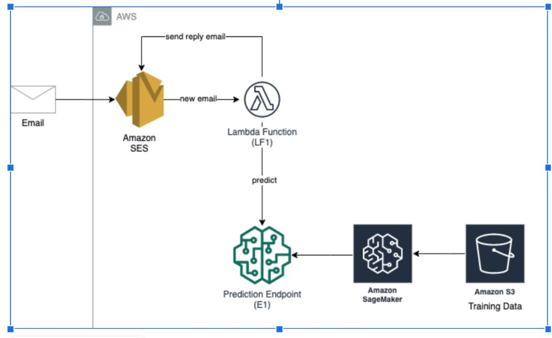

# Spam-Detection

Implemented a system that upon receipt of an email message, it will automatically flag it as spam or not, based on the prediction obtained from the machine learning model using Amazon SageMaker on AWS.

